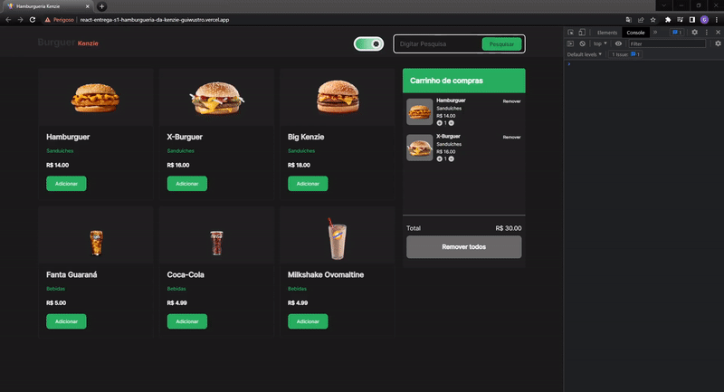

<!-- PROJECT LOGO -->
 

  

<h1 align="center">Hamburgueria da Kenzie</h1>

  

    É uma aplicação de página única de um e-commerce, o qual possui uma vitrine com produtos com botões de adicionar ao carrinho, um carrinho de compras e uma barra de filtros, um campo de pesquisa.
     
  

## Sobre o projeto

A aplicação conta com um tema escuro além do tema claro, para o usuário
escolher, e o tema fica salvo na página do usuário, ou seja, caso o usuário
selecione o modo escuro, a próxima vez que ele conectar na página continuará
sendo esse modo.  

O carrinho de compras só é visível ao usuário quando algum produto é adicionado
ao carrinho. Dentro dele o usuário é capaz de aumentar, diminuir a quantidade do
produto através dos botões + e - ou remover o produto. É feito automaticamente o
cálculo ao cliente do carrinho a cada adição, diminuição ou remoção de produto.

## Tecnologias utilizadas

O projeto foi realizado em React, e as bibliotecas utilizadas foram:

- Axios;
- Styled components;
- Context API;
- React icons;
- Hooks (UseHook, UseEffect);
<!-- USAGE EXAMPLES -->

## Usabilidade

## Features

- [x] Vitrine com os produtos do e-commerce;
- [x] Botão com a opção de adicionar ao carrinho em cada produto do e-commerce;
- [x] Campo de pesquisa funcional para pesquisar por categoria ou nome do
      produto;
- [x] Dark-mode;
- [x] Opção de aumentar, diminuir quantidade e remover pelo carrinho de compras
      ;
- [x] Cálculo total do carrinho de compras;
- [x] Opção de remover todos os produtos do carrinho;
- [x] Responsivo para qualquer tela;
